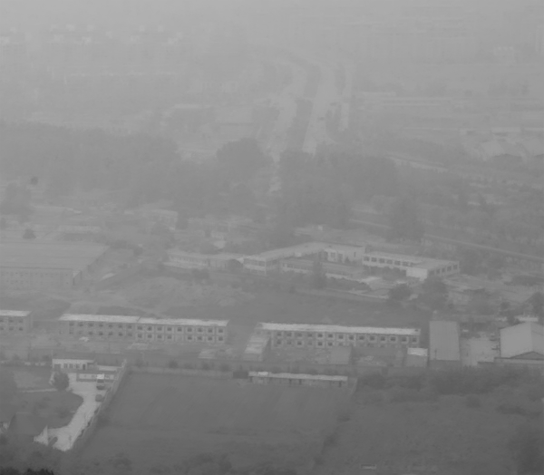

# GuidedFilter
This repo contains different implementations of [Guided Filter](http://research.microsoft.com/en-us/um/people/kahe/eccv10/).

## Why
Why would I set this repo?

Guided image filtering has been quite useful in computer vision since it was first introduced in 2010 by Kaiming He. And Guided Filter is now included in official [OpenCV 3.0](http://docs.opencv.org/master/da/d17/group__ximgproc__filters.html#ga86813d59f8452a9600e979c6287805f5&gsc.tab=0) as a new function.

I have been using guided image filtering for a while. At first I implemented it myself in C. After OpenCV 3.0 included Guided Filter, I tested it and compared the results with my own implementation and the MATLAB version offered at the [author's website](http://research.microsoft.com/en-us/um/people/kahe/eccv10/). 

The OpenCV 3.0's official version of Guided Filter is quite fast. But I found that in some cases, e.g. some particular parameters, the OpenCV version might get wrong results. However, with the same parameters, the MATLAB version and my own implementation still get reasonable and correct results.

Here is one of the comparison below.

### The guidance image

### The input image(a.k.a The image needs to be filtered)

### The results of my own implementation

### The MATLAB implementation by author

## The OpenCV 3.0 implementation

This is not the only instance that the OpenCV version gets wrong results.

FYI, the parameters:
+ radius:3
+ eps:1e-6
+ using color image as the guidance

The code:
+ [My own implementation](GuidedFilter/GuidedFilter/guidedfilter.cpp)
+ [MATLAB codes by author](MATLAB/guidedfilter_color.m)
+ [OpenCV 3.0 source code](https://github.com/Itseez/opencv_contrib/blob/master/modules/ximgproc/src/guided_filter.cpp)